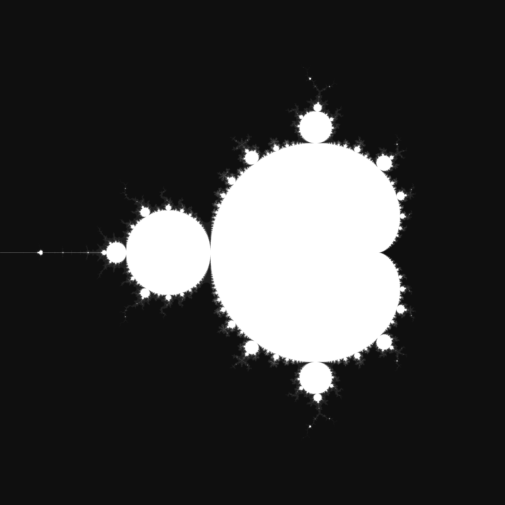
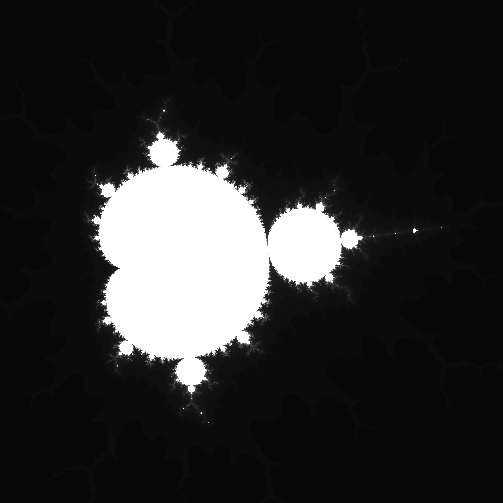

# Mandelbrot Zoom Generator

### Overview:

This project is for generating zooms of the Mandelbrot set with high precision. 

### Compilation Instructions:

- If you have the nix package manager, run `nix shell`.
- If you don't have it, follow these steps:
   - Install the gmp, gmpxx, and libpng headers and shared libraries
   - Run the following commands:

```bash
export CXXCOMPILER=clang++
export CXXFLAGS=-std=c++20 -Wall -Wextra -Wno-sign-compare -LTO -O3
export LDFLAGS=-lpng -lgmp -lgmpxx
make
```

### Usage:

To generate the Mandelbrot set, use the following format:
```
main <bottom-left coordinate> <top-left coordinate> <width>x<height> <output png path>
```

For example, to generate the entire Mandelbrot set, run:
```
main -2+-1.5i 1+1.5i 3000x3000 result.png
```

The output will look like this:


### High Magnification:

The aim of this project is to produce very high magnification zooms of the set. Even for a quick two-minute (on a 12th gen i7) run, a 3750x magnification can be achieved with the following command:
```
main -0.16385+1.0974i -0.16305+1.0982i 3000x3000 test/test11.png
```

Before running the above, change the “iterations” parameter in the include/params.hpp file to 1024 and recompile. The output will look like this:
